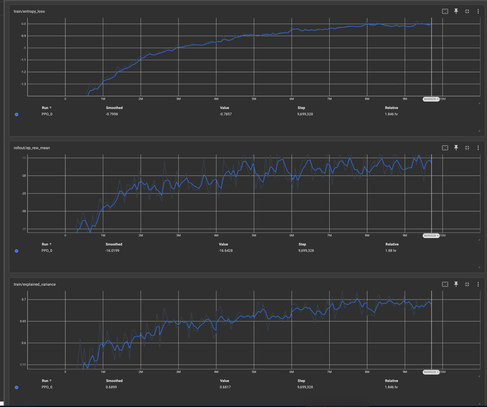

# 📊 Gen3 RL Pipeline: v1 Final Report

This document serves as the final evaluation and architectural summary for the first version (v1) of the Gen3 reinforcement learning pipeline. It marks the conclusion of the "Flat MLP" era and sets the baseline for future architectural upgrades.

## 🏗 v1 Architecture Recap

The v1 pipeline successfully established a robust, self-describing foundation for Pokémon RL:

### 1. The Observation System (`state_encoder.py`)
- **Modular Sub-Encoders:** We moved away from hardcoded magic numbers by implementing dedicated encoders for Species, Items, Types, Abilities, and Moves.
- **Static Ordering & Integrity:** The observation array preserves static ordering for our team to prevent state-flickering, and utilizes stable slot mapping for opponent Pokémon (crucial for mechanics like Transform).
- **Deep Trace Diagnostics:** Built-in capabilities to translate the raw numeric vector back into a highly readable, perfectly aligned human trace for real-time debugging.

### 2. The Model (`features_extractor.py`)
- **Shared Latent Embeddings:** We successfully implemented PyTorch `nn.Embedding` layers for all categorical IDs (species, items, moves), allowing the model to learn semantic relationships.
- **The Flat MLP:** The final v1 brain concatenates all 12 Pokémon (plus global state) into a massive ~3,500-dimension vector. This vector is passed through a single Linear projection layer (`3500 -> 512`) before being handed off to Stable Baselines 3's default `[512, 512]` policy network.

---

## 🏆 Final Performance Metrics

**Date**: 2026-05-11
**Checkpoint**: `checkpoint_9600000_steps.zip` (9.6M Steps)
**Configuration**: 10,000 Total Battles (5k vs Random, 5k vs Heuristic) | Concurrency: 200

| Opponent Type | Win Rate | Total Duration |
| :--- | :---: | :--- |
| **Random Player** | **85.7%** | 5m 56s |
| **Simple Heuristics** | **22.6%** | 4m 15s |

### 📝 Evaluation Observations
- **Dominance over Random**: The agent has successfully mastered basic win conditions and mechanics, effectively neutralizing random noise.
- **Heuristic Plateau**: The 22.6% win rate against `SimpleHeuristicsPlayer` confirms a strategic plateau. The agent struggles against the heuristic's basic switching and move-selection logic.
- **Efficiency**: Large-scale evaluation (10k battles) now completes in under 11 minutes total using the optimized `--eval-concurrency 200` setting.

---

## 📈 Training Trajectory & Conclusion

As seen in the training logs, the v1 architecture experienced rapid initial learning and eventually settled into a highly confident plateau. 

**The Verdict:**
The v1 model proves that the observation space and embedding strategies are sound. The agent has enough raw parameter capacity to memorize basic mechanics and dominate random opponents (85.7% win rate). 

However, the 22.6% win rate against the heuristic bot perfectly illustrates the "Flat MLP Bottleneck." Because the network concatenates all Pokémon into a single massive vector, it treats every slot combination as a unique state. It cannot easily answer relational queries like *"Does my benched Swampert counter their active Salamence?"*

To break this plateau, the pipeline must evolve beyond flat concatenation. Version 2 (v2) will execute the progressive roadmap, introducing **Shared Move Processors**, **Pokémon Role Encoders**, and **Team Attention Mechanisms** to give the agent true relational reasoning.
