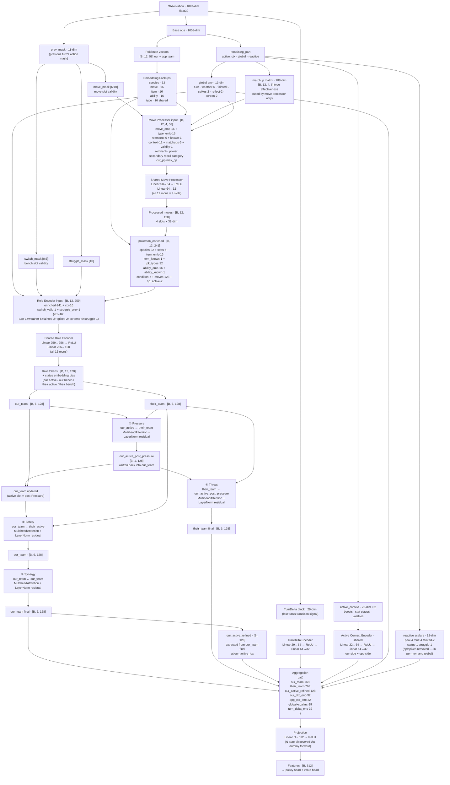

# Gen3AI Network Architecture

Feature extractor used by MaskablePPO. Takes a 1093-dim observation and produces 512-dim features for the policy and value heads.

## Data Flow Digraph

## Dimension Reference

| Layer | Input dim | Output dim | Notes |
|---|---|---|---|
| Move Processor | 58 | 32 | shared; run 12×4 times per forward pass |
| Role Encoder | 259 | 128 | shared; run 12 times per forward pass |
| Active Ctx Encoder | 22 | 32 | shared; run twice (our side + opp side) |
| TurnDelta Encoder | 29 | 32 | encodes last-turn signal before projection |
| Pressure Attn | 128 (Q), 128 (KV) | 128 | our_active queries their_team |
| Safety Attn | 128 (Q), 128 (KV) | 128 | our_team queries their_active |
| Synergy Attn | 128 (Q/K/V) | 128 | our_team self-attention |
| Threat Attn | 128 (Q), 128 (KV) | 128 | their_team queries our_active_post_pressure |
| Projection | N (auto) | 512 | N determined by dummy forward in `__init__` |

## Observation Layout

| Block | Dims | Offset |
|---|---|---|
| Our team (6 × 58) | 348 | 0 |
| Opp team (6 × 58) | 348 | 348 |
| Active context ×2 (boosts, volatiles) | 44 | 696 |
| Global env | 13 | 740 |
| Reactive scalars + matchup matrix | 300 | 753 |
| **prev_mask** | **11** | **1053** |
| **TurnDelta block** | **29** | **1064** |
| **Total** | **1093** | |

The matchup matrix (288 of the 300 reactive dims) is consumed by the move processor only — it is **not** fed to the projection directly. The TurnDelta block is appended by `gen3_env.embed_battle()` and fed directly into the projection aggregation.

## TurnDelta Block Layout (29 dims, offset 1064)

| Field | Dims | Notes |
|---|---|---|
| our_move features | 5 | id_norm, power/200, has_secondary, has_recoil, type_id_norm |
| opp_move features | 5 | same |
| our_switched | 1 | bool |
| opp_switched | 1 | bool |
| our_failed_to_move | 1 | bool |
| opp_failed_to_move | 1 | bool |
| our_cant_reason | 5 | one-hot: par / slp / frz / flinch / confusion |
| opp_cant_reason | 5 | same |
| our_hp_delta | 1 | sum of our HP delta vector (negative = damage taken) |
| opp_hp_delta | 1 | sum of opp HP delta vector |
| we_fainted | 1 | bool |
| opp_fainted | 1 | bool |
| opp_move_known | 1 | False on Explosion gap or first active turn |

All zeros on the first turn of each episode (`TurnDelta.empty()`). See `src/agents/observation/turn_delta_encoder.py`.

## Per-Pokémon Vector (58 dims)

| Field | Dims | Notes |
|---|---|---|
| Species ID | 1 | embedded → 32 |
| Base stats | 6 | hp/atk/def/spa/spd/spe |
| Item ID | 1 | embedded → 16 |
| Item known | 1 | |
| Type 1 ID | 1 | embedded → 16, concatenated (not summed) |
| Type 2 ID | 1 | embedded → 16 |
| Ability ID | 1 | embedded → 16 |
| Ability known | 1 | |
| Condition (status one-hot) | 7 | None, BRN, PAR, SLP, FRZ, PSN, TOX |
| Moves (4 × 9) | 36 | id, power, secondary, recoil, type_id, category, known, cur_pp, max_pp |
| HP fraction | 1 | |
| Active flag | 1 | |

## Attention Path Summary

| Path | Query | Keys/Values | Updates | Purpose |
|---|---|---|---|---|
| ① Pressure | our_active | their_team | our_active | What threatens our active right now? |
| ② Safety | our_team | their_active | our_team | Which of our bench can safely switch in? |
| ③ Synergy | our_team | our_team | our_team | Internal team role cohesion |
| ④ Threat | their_team | our_active | their_team | Which of their bench counters us most? |

Pressure result is written back into `our_team` before Safety/Synergy run, so all paths compose correctly. `our_active_refined` is extracted from the fully-composed `our_team` after all four paths.

## Key Files

| File | Role |
|---|---|
| `src/agents/model/features_extractor.py` | Network definition |
| `src/agents/observation/state_encoder.py` | Observation encoding; owns `base_dimension` (1053) and `dimension` (1093) |
| `src/agents/observation/turn_delta_encoder.py` | TurnDelta → 29-dim float32 block |
| `src/agents/training/battle_context.py` | `BattleContext` snapshot + `TurnDelta` diff |
| `src/agents/observation/constants.py` | Layout offsets and dimension constants |
| `src/agents/observation/reactive.py` | Reactive block encoder; `get_layout()` drives reactive offsets in the network |
| `designs/ai_v3/impl_step3_turn_transition_signal.md` | Design notes for TurnDelta + cant-move tracking |
| `designs/ai_v3/network_review.md` | Full architectural review with prioritised suggestions |
