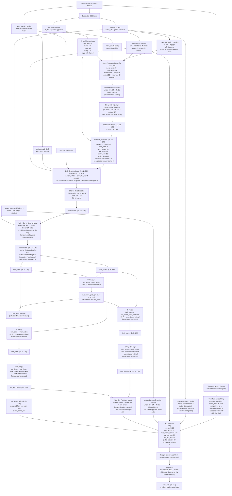

# Gen3AI Network Architecture

Feature extractor used by MaskablePPO. Takes a 1105-dim observation and produces 512-dim features for the policy and value heads.

## Data Flow Digraph

## Dimension Reference

| Layer | Input dim | Output dim | Notes |
|---|---|---|---|
| Move Processor | 58 | 32 | shared; run 12×4 times per forward pass |
| Move Self-Attention | 32 (Q/K/V) | 32 | per-mon 4-slot self-attn; run 12 times |
| Role Encoder | 260 | 128 | shared; run 12 times per forward pass |
| Active Ctx → Role (injection) | 23 | 128 | shared MLP; bias added to active slot's role token only, before all 5 attention paths |
| Active Ctx Encoder (direct) | 23 | 32 | shared; run twice (our side + opp side); appended to final projection input |
| Pressure Attn | 128 (Q), 128 (KV) | 128 | our_active queries their_team |
| Safety Attn | 128 (Q), 128 (KV) | 128 | our_team queries their_active; fainted queries zeroed |
| Synergy Attn | 128 (Q/K/V) | 128 | our_team self-attention; fainted keys+queries masked |
| Threat Attn | 128 (Q), 128 (KV) | 128 | their_team queries our_active_post_pressure; fainted queries zeroed |
| Opp Synergy Attn | 128 (Q/K/V) | 128 | their_team self-attention; fainted keys+queries masked |
| Our Pool Attn | 128 (Q), 128 (KV) | 128 | learned query over our_team (fainted key-masked) |
| Their Pool Attn | 128 (Q), 128 (KV) | 128 | learned query over their_team (fainted key-masked) |
| Pre-proj LayerNorm | 562 | 562 | equalises scales before projection |
| Projection | 562 | 512 | N auto-discovered via dummy forward in `__init__` |

## Observation Layout

| Block | Dims | Offset |
|---|---|---|
| Our team (6 × 59) | 354 | 0 |
| Opp team (6 × 59) | 354 | 354 |
| Active context ×2 (boosts, volatiles) | 44 | 708 |
| Global env | 13 | 752 |
| Reactive scalars + matchup matrix | 300 | 765 |
| **prev_mask** | **11** | **1065** |
| **TurnDelta block** | **29** | **1076** |
| **Total** | **1105** | |

The matchup matrix (288 of the 300 reactive dims) is consumed by the move processor only — it is **not** fed to the projection directly. The TurnDelta block is appended by `gen3_env.embed_battle()` and routed through the extractor's embedding tables (move/type IDs embedded; 25 scalars kept raw) producing a 89-dim embedded block at the projection.

## TurnDelta Block Layout (29 dims, offset 1076)

| Field | Dims | Notes |
|---|---|---|
| our_move_id | 1 | raw int (embedded → 16-dim in extractor) |
| our_power_norm | 1 | basePower / 200 |
| our_has_secondary | 1 | bool |
| our_has_recoil | 1 | bool |
| our_type_id | 1 | raw int (embedded → 16-dim in extractor) |
| opp_move_id | 1 | raw int (embedded → 16-dim in extractor) |
| opp_power_norm | 1 | |
| opp_has_secondary | 1 | |
| opp_has_recoil | 1 | |
| opp_type_id | 1 | raw int (embedded → 16-dim in extractor) |
| our_switched | 1 | bool |
| opp_switched | 1 | bool |
| our_failed_to_move | 1 | bool |
| opp_failed_to_move | 1 | bool |
| our_cant_reason | 5 | one-hot: par / slp / frz / flinch / confusion |
| opp_cant_reason | 5 | same |
| our_hp_delta | 1 | sum of our HP delta vector (negative = damage taken) |
| opp_hp_delta | 1 | sum of opp HP delta vector |
| we_fainted | 1 | bool |
| opp_fainted | 1 | bool |
| opp_move_known | 1 | False on Explosion gap or first active turn |

After embedding in the extractor: 4 × 16-dim embeddings + 25 raw scalars = **89-dim** block fed into the projection aggregation.

All zeros on the first turn of each episode (`TurnDelta.empty()`). See `src/agents/observation/turn_delta_encoder.py`.

## Per-Pokémon Vector (59 dims)

| Field | Dims | Notes |
|---|---|---|
| Species ID | 1 | embedded → 32 |
| Base stats | 6 | hp/atk/def/spa/spd/spe |
| Item ID | 1 | embedded → 16 |
| Item known | 1 | |
| Type 1 ID | 1 | embedded → 16, concatenated (not summed) |
| Type 2 ID | 1 | embedded → 16 |
| Ability ID | 1 | embedded → 16 |
| Ability known | 1 | |
| Condition (status one-hot) | 7 | None, BRN, PAR, SLP, FRZ, PSN, TOX |
| Moves (4 × 9) | 36 | id, power, secondary, recoil, type_id, category, known, cur_pp, max_pp |
| HP fraction | 1 | |
| Species known | 1 | 1.0 if slot is populated; 0.0 if absent (unseen opp slot) |
| Active flag | 1 | appended by `state_encoder.py`, not `pokemon_encoder.py` |

## Attention Path Summary

| Path | Query | Keys/Values | Updates | Purpose |
|---|---|---|---|---|
| ① Pressure | our_active | their_team | our_active | What threatens our active right now? |
| ② Safety | our_team | their_active | our_team (fainted zeroed) | Which of our bench can safely switch in? |
| ③ Synergy | our_team | our_team | our_team (fainted zeroed) | Internal team role cohesion |
| ④ Threat | their_team | our_active | their_team (fainted zeroed) | Which of their bench counters us most? |
| ⑤ Opp Synergy | their_team | their_team | their_team (fainted zeroed) | Opponent team internal role cohesion |
| Pool (×2) | learned query | each team | 128-dim pool token | Permutation-equivariant team summary |

Pressure result is written back into `our_team` before Safety/Synergy run, so all paths compose correctly. `our_active_refined` is extracted from the fully-composed `our_team` after all paths.

All 5 paths operate on role tokens that have already received the **active-context injection** (boosts + volatile effects projected via `active_ctx_to_role`), so Safety can see "+2 Atk on their active", Threat can see "our active has Substitute up", etc.

## Key Files

| File | Role |
|---|---|
| `src/agents/model/features_extractor.py` | Network definition |
| `src/agents/observation/state_encoder.py` | Observation encoding; owns `base_dimension` (1065) and `dimension` (1105) |
| `src/agents/observation/turn_delta_encoder.py` | TurnDelta → 29-dim float32 block (move/type IDs as raw ints) |
| `src/agents/training/battle_context.py` | `BattleContext` snapshot + `TurnDelta` diff |
| `src/agents/observation/constants.py` | Layout offsets and dimension constants |
| `src/agents/observation/reactive.py` | Reactive block encoder; `get_layout()` drives reactive offsets in the network |
| `designs/ai_v3/impl_step3_turn_transition_signal.md` | Design notes for TurnDelta + cant-move tracking |
| `designs/ai_v3/network_review.md` | First architectural review |
| `designs/ai_v3/network_review_2.md` | Second architectural review (pruned of retracted items) |
