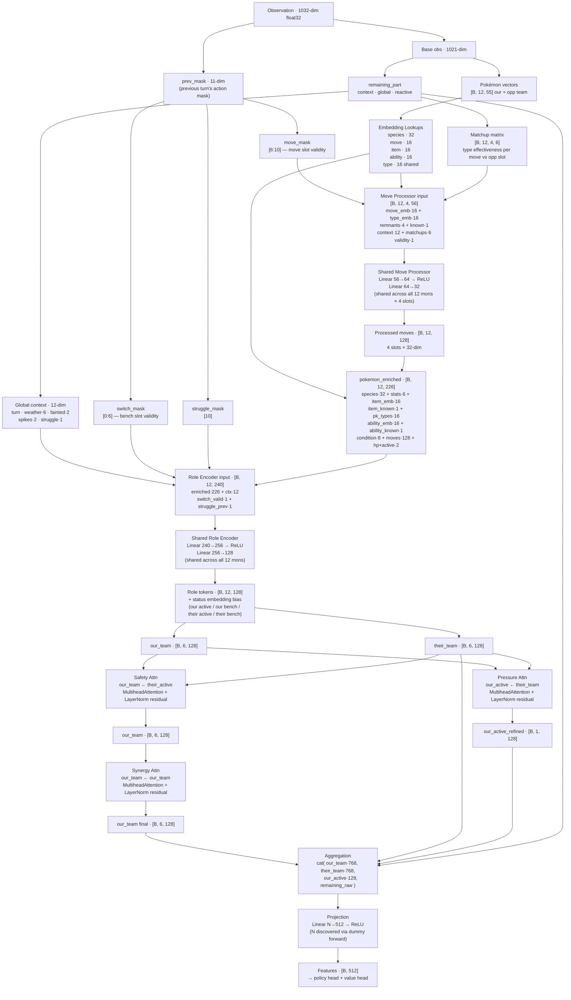

# Gen3AI Network Architecture

Feature extractor used by MaskablePPO. Takes a 1032-dim observation and produces 512-dim features for the policy and value heads.

## Data Flow Digraph

## Dimension Reference

| Layer | Input dim | Output dim | Notes |
|---|---|---|---|
| Move Processor | 56 | 32 | shared; run 12×4 times per forward pass |
| Role Encoder | 240 | 128 | shared; run 12 times per forward pass |
| Pressure Attn | 128 (Q), 128 (KV) | 128 | our_active queries their_team |
| Safety Attn | 128 (Q), 128 (KV) | 128 | our_team queries their_active |
| Synergy Attn | 128 (Q/K/V) | 128 | our_team self-attention |
| Projection | N (auto) | 512 | N determined by dummy forward in `__init__` |

## Observation Layout

| Block | Dims | Offset |
|---|---|---|
| Our team (6 × 55) | 330 | 0 |
| Opp team (6 × 55) | 330 | 330 |
| Active context ×2 | 44 | 660 |
| Global env | 13 | 704 |
| Reactive + matchups | 304 | 717 |
| **prev_mask** | **11** | **1021** |
| **Total** | **1032** | |

## Key Files

| File | Role |
|---|---|
| `src/agents/model/features_extractor.py` | Network definition |
| `src/agents/observation/state_encoder.py` | Observation encoding; owns `base_dimension` (1021) and `dimension` (1032) |
| `src/agents/observation/constants.py` | Layout offsets and dimension constants |
| `designs/ai_v3/impl_step2_obs_features.md` | Design notes for the prev_mask feature |
