# Gen3AI Network Architecture

Feature extractor used by MaskablePPO. Takes a 1309-dim observation and produces 512-dim features for the policy and value heads.

## Data Flow Digraph

```mermaid
flowchart TD
    OBS["Observation · 1309-dim float32"]

    OBS --> BASE["Base obs · 1103-dim"]
    OBS --> PM["prev_mask · 11-dim\n(previous turn's action mask;\nmove bits reordered action→sorted-by-id\nin EpisodeTracker.prev_mask)"]
    OBS --> HIST["Turn history · 195-dim\n(5 × 39-dim TurnDelta, oldest first)"]

    PM --> SW["switch_mask [0:6]\nbench slot validity"]
    PM --> MV["move_mask [6:10]\nmove slot validity\n(sorted-by-id order, aligned to move embeddings)"]
    PM --> STR["struggle_mask [10]"]

    BASE --> TEAM["Pokémon vectors\n[B, 12, 62]  our + opp team"]
    BASE --> REM["remaining_part\nactive_ctx · global · reactive"]

    TEAM --> EMB["Embedding Lookups\nspecies · 32\nmove · 16\nitem · 16\nability · 16\ntype · 16  shared"]
    REM --> ACT_RAW["active_context · 23-dim × 2\nboosts · stat stages · volatiles"]
    REM --> GLOBAL["global env · 13-dim\nturn · weather·6 · fainted·2\nspikes·2 · reflect·2 · screen·2"]
    REM --> REACT["reactive scalars · 12-dim\nstatus·1 struggle·1 fainted·2\nour_matchup_scalars·8\n(matchup matrix used only by move processor)"]
    REM --> MATCH["matchup matrix · 288-dim\n[B, 12, 4, 6] type effectiveness\n(used by move processor only)"]

    HIST --> TDHIST["5 TurnDelta slots\n[B, 5, 39]"]
    TDHIST --> TDEMB["Per-slot embedding (shared weights)\nour/opp move id → move_emb·16 each\nour/opp type id → type_emb·16 each\n+ 35 scalar remnants\n= 99-dim per slot → [B, 5, 99]"]
    TDEMB --> TDPOS["+ learned positional encodings\n[B, 5, 99]"]
    TDPOS --> TDATTN["Turn History Self-Attention\nMHA 99-dim, 3 heads\n+ LayerNorm residual\n[B, 5, 99]"]
    TDATTN --> TDOUT["take last position\n→ 99-dim history-informed token\n[B, 99]"]

    EMB --> MPIN

    MV --> MPIN["Move Processor input · [B, 12, 4, 58]\nmove_emb·16 + type_emb·16\nremnants·6 + known·1\ncontext·12 + matchups·6 + validity·1\n(validity=active mon's mask in SORTED move order;\nbench gets 1s)"]
    MATCH --> MPIN
    GLOBAL --> MPIN

    MPIN --> MP["Shared Move Processor\nLinear 58→64 → ReLU\nLinear 64→32\n(all 12 mons × 4 slots)"]
    MP --> MSA["Move Self-Attention\nMHA 32-dim, 2 heads\nper-mon 4-slot self-attn + residual+LN\n(lets moves see each other)"]
    MSA --> PMOV["Processed moves · [B, 12, 128]\n4 slots × 32-dim"]

    EMB --> PE["pokemon_enriched · [B, 12, 245]\nspecies·32 + stats·6 + item_emb·16\nitem_known·1 + item_consumed·1 + pk_types·32\nability_emb·16 + ability_known·1\ncondition·7 + moves·128\nhp+species_known+sleep_ctr+toxic_ctr+active·5"]
    PMOV --> PE

    GLOBAL --> RIN
    SW --> RIN
    STR --> RIN
    PE --> RIN["Role Encoder input · [B, 12, 263]\nenriched·245 + ctx·16\nswitch_valid·1 + struggle_prev·1\n(ctx·16: turn·1+weather·6+fainted·2\n+spikes·2+screens·4+struggle·1)"]

    RIN --> RE["Shared Role Encoder\nLinear 263→256 → ReLU\nLinear 256→128\n(all 12 mons)"]
    RE --> RT0["Role tokens · [B, 12, 128]"]

    ACT_RAW --> ACTINJ["Active Ctx → Role · shared\nLinear 23→64 → ReLU → Linear 64→128\n→ + injected into active slot only\n(bench mons have no boosts/volatiles)"]
    RT0 --> ACTINJ

    HIST --> TDCOND["TurnDelta Conditioner\nstrategic slice [our_eff·4, opp_eff·4, order·2]\nLinear 10→64 → ReLU → Linear 64→128\nperspective-flipped for opp active\n→ + injected into active slots only"]
    RT0 --> TDCOND

    ACTINJ --> RT["Role tokens · [B, 12, 128]\n+ active-ctx bias at active slots\n+ TurnDelta strategic bias at active slots\n+ status embedding bias\n(our active=0 / our bench=1 / their active=2 / their bench=3)"]
    TDCOND --> RT

    RT --> OT["our_team · [B, 6, 128]"]
    RT --> TT["their_team · [B, 6, 128]"]

    OT --> PA["① Pressure\nour_active ← their_team\nMHA + LayerNorm residual\n(no fainted key-mask: fainted opp history is useful context)"]
    TT --> PA
    PA --> OAP["our_active_post_pressure\n[B, 1, 128]\nwritten back into our_team"]

    OAP --> OT2["our_team updated\n(active slot = post-Pressure)"]
    OT --> OT2

    OT2 --> SA["② Safety\nour_team ← their_active\nMHA + LayerNorm residual\nfainted queries zeroed"]
    TT --> SA
    SA --> OT3["our_team · [B, 6, 128]"]

    OT3 --> SYA["③ Synergy\nour_team ← our_team\nMHA (fainted key-masked)\n+ LayerNorm residual\nfainted queries zeroed"]
    SYA --> OT4["our_team final · [B, 6, 128]"]

    OAP --> THA["④ Threat\ntheir_team ← our_active_post_pressure\nMHA + LayerNorm residual\nfainted queries zeroed"]
    TT --> THA
    THA --> TT2["their_team · [B, 6, 128]"]

    TT2 --> OSY["⑤ Opp Synergy\ntheir_team ← their_team\nMHA (fainted key-masked)\n+ LayerNorm residual\nfainted queries zeroed"]
    OSY --> TT3["their_team final · [B, 6, 128]"]

    OT4 --> POOL["Attention Pool (per team)\nlearned query → MHA over 6 role tokens\nfainted slots key-masked\n→ one 128-dim token per side"]
    TT3 --> POOL
    OT4 --> OAR["our_active_refined · [B, 128]\nextracted from our_team final\nat our_active_idx"]
    OAR --> AGG

    POOL --> AGG["Aggregation · 576-dim\ncat(\n  our_pool·128\n  their_pool·128\n  our_active_refined·128\n  our_ctx_enc·32\n  opp_ctx_enc·32\n  global+scalars·29\n  turn_delta_emb·99\n)"]
    ACT_RAW --> ACTENC["Active Context Encoder · shared\nLinear 23→64 → ReLU → Linear 64→32\nour side + opp side (direct path)"]
    ACTENC --> AGG
    GLOBAL --> AGG
    REACT --> AGG
    TDOUT --> AGG

    AGG --> LN["Pre-projection LayerNorm\n(equalises per-block scales)"]
    LN --> PROJ["Projection\nLinear 576→512 → ReLU\n(576 auto-discovered via dummy forward in __init__)"]
    PROJ --> OUT["Features · [B, 512]\n→ policy head + value head"]
```

## Ordering integrity (move-validity alignment)

The feature extractor reads each mon's move slots in **sorted-by-id** order
(`MovesEncoder` → `get_sorted_moves`), but the action mask / mapper index moves
in **request order**. The per-move validity bit must therefore be reordered into
sorted order before it reaches the move processor — otherwise the "is this move
legal" bit lands on a *different* move's embedding (silent when all moves are
legal, wrong on disabled / zero-PP / Taunt turns).

- **Fix:** `EpisodeTracker.prev_mask` reorders the move bits action→sorted before
  the obs is built (`reorder_move_bits_to_sorted` in
  `agents/action/ordering_integrity.py`), validated in place.
- **Always-on guards** (raise `OrderingMismatchError`, in training + inference):
  - *sorted-validity correctness* — `assert_sorted_validity_correct` at
    `prev_mask` construction.
  - *team/switch alignment* — `check_switch_ordering_alignment` in `get_mask`
    (mask/mapper team order == encoder `get_team_list` order).
  - *outcome vs intent* — `check_outcome_matches_intent` at the live TurnDelta
    site (`EpisodeTracker.build_delta`, `RewardTracker.complete_pending`): the
    move the chosen action maps to must equal what the protocol says fired,
    excepting `cant`/forced-switch turns.
- Switches need no reorder: action index, switch-validity bit, and per-Pokémon
  obs slot all share the single `list(battle.team.values())` ordering.

## Dimension Reference

| Layer | Input dim | Output dim | Notes |
|---|---|---|---|
| Move Processor | 58 | 32 | shared; run 12×4 times per forward pass |
| Move Self-Attention | 32 (Q/K/V) | 32 | per-mon 4-slot self-attn; run 12 times |
| Role Encoder | 263 | 128 | shared; run 12 times per forward pass; dim computed dynamically in `__init__` |
| Active Ctx → Role (injection) | 23 | 128 | shared MLP; bias added to active slot's role token only, before all 5 attention paths |
| TurnDelta Conditioner (injection) | 10 | 128 | shared MLP; strategic slice (eff×2 + order); bias added to active slots only, perspective-flipped for opp |
| Active Ctx Encoder (direct) | 23 | 32 | shared; run twice (our side + opp side); appended to final projection input |
| Turn History Self-Attention | 99 (Q/K/V) | 99 | 5-slot self-attn with positional encodings; last slot used for projection |
| Pressure Attn | 128 (Q), 128 (KV) | 128 | our_active queries their_team (no fainted mask — fainted history is useful) |
| Safety Attn | 128 (Q), 128 (KV) | 128 | our_team queries their_active; fainted queries zeroed |
| Synergy Attn | 128 (Q/K/V) | 128 | our_team self-attention; fainted keys+queries masked |
| Threat Attn | 128 (Q), 128 (KV) | 128 | their_team queries our_active_post_pressure; fainted queries zeroed |
| Opp Synergy Attn | 128 (Q/K/V) | 128 | their_team self-attention; fainted keys+queries masked |
| Our Pool Attn | 128 (Q), 128 (KV) | 128 | learned query over our_team (fainted key-masked) |
| Their Pool Attn | 128 (Q), 128 (KV) | 128 | learned query over their_team (fainted key-masked) |
| Pre-proj LayerNorm | 576 | 576 | equalises scales before projection |
| Projection | 576 | 512 | N auto-discovered via dummy forward in `__init__` |

## Observation Layout

| Block | Dims | Offset |
|---|---|---|
| Our team (6 × 62) | 372 | 0 |
| Opp team (6 × 62) | 372 | 372 |
| Active context ×2 (boosts, volatiles) | 46 | 744 |
| Global env | 13 | 790 |
| Reactive scalars + matchup matrix | 300 | 803 |
| **prev_mask** | **11** | **1103** |
| **Turn history (5 × 39)** | **195** | **1114** |
| **Total** | **1309** | |

The matchup matrix (288 of the 300 reactive dims) is consumed by the move processor only — it is **not** fed to the projection directly. The turn history block is appended by `gen3_env.embed_battle()`. All 5 slots are embedded identically and processed through self-attention; the last (most-recent) slot's output is used in the projection aggregation.

## TurnDelta Block Layout (108 dims per slot)

> **Note:** the digraph above predates the ai_v4 unified transformer and the
> TurnDelta expansions — slot count, embed dims, and the attention topology there
> are stale. The table below is kept current because it is a self-contained
> dimension reference. For the live architecture see `designs/ai_v4/`
> (`impl_step4_unified_transformer.md`, `impl_step3_damaging_event_attribution.md`,
> `impl_step5_move_outcome.md`) and the authoritative docstring in
> `src/agents/observation/turn_delta_encoder.py`.

**Base block (51 dims):**

| Field | Dims | Notes |
|---|---|---|
| our_move (id, power, secondary, recoil, type) | 5 | id + type are raw ints (embedded → 16-dim each in extractor) |
| opp_move (id, power, secondary, recoil, type) | 5 | same |
| our_switched / opp_switched | 2 | bool |
| our_failed_to_move / opp_failed_to_move | 2 | bool |
| our_cant_reason | 11 | one-hot: par / slp / frz / flinch / confusion / recharge / taunt / disable / imprison / truant / nopp (prefix-normalized) |
| opp_cant_reason | 11 | same |
| our_hp_delta / opp_hp_delta | 2 | sum of each side's HP delta vector (negative = damage taken) |
| we_fainted / opp_fainted | 2 | bool |
| opp_move_known | 1 | False on Explosion gap or first active turn |
| our_effectiveness / opp_effectiveness | 4 + 4 | one-hot: immune / resisted / normal / super-effective |
| move_order | 2 | [we_first, opp_first]; all-zero = na / both switched |

**Extended block (57 dims):**

| Field | Dims | Notes |
|---|---|---|
| our_boost_delta / opp_boost_delta | 7 + 7 | stat-stage deltas (BOOST_STATS order) |
| phase_is_forced_switch | 1 | half-turn replacement slot vs full action-pair slot |
| our_target_hp_delta / opp_target_hp_delta | 1 + 1 | HP delta on the named target of each side's damaging move |
| our_hp_levels / opp_hp_levels | 6 + 6 | end-of-turn HP for every team slot |
| our_target_status / opp_target_status | 7 + 7 | one-hot status of the named target at move-fire time |
| our_move_outcome / opp_move_outcome | 3 + 3 | one-hot: hit / miss / fail; all-zero = switch / cant / no move |
| our_move_crit / opp_move_crit | 1 + 1 | bool; orthogonal to outcome (a hit may also crit) |
| species IDs (our/opp × actor/target/switch_to) | 6 | raw ints, contiguous slot tail (embedded → 32-dim each) |

The six species IDs are kept as the contiguous **tail** so the extractor can slice
them for embedding; move-outcome + crit are pass-through scalars placed immediately
before them. After embedding: 4 × 16-dim move/type + 6 × 32-dim species + 98 raw
scalars = **354-dim** block per slot.

All zeros on the first turn of each episode (`TurnDelta.empty()`). See
`src/agents/observation/turn_delta_encoder.py` for the canonical layout (offsets
are computed from `*_DIM` constants — never hardcode an index).

## Per-Pokémon Vector (62 dims)

| Field | Dims | Notes |
|---|---|---|
| Species ID | 1 | embedded → 32 |
| Base stats | 6 | hp/atk/def/spa/spd/spe |
| Item ID | 1 | embedded → 16 |
| Item known | 1 | |
| Item consumed | 1 | 1.0 when item spent this battle (Berry, Knock Off, Trick, etc.) |
| Type 1 ID | 1 | embedded → 16, concatenated (not summed) |
| Type 2 ID | 1 | embedded → 16 |
| Ability ID | 1 | embedded → 16 |
| Ability known | 1 | |
| Condition (status one-hot) | 7 | None, BRN, PAR, SLP, FRZ, PSN, TOX |
| Moves (4 × 9) | 36 | id, power, secondary, recoil, type_id, category, known, cur_pp, max_pp |
| HP fraction | 1 | |
| Species known | 1 | 1.0 if slot is populated; 0.0 if absent (unseen opp slot) |
| Sleep counter norm | 1 | min(turns_slept, 4) / 4 |
| Toxic counter norm | 1 | min(turns_poisoned, 8) / 8 |
| Active flag | 1 | appended by `state_encoder.py`, not `pokemon_encoder.py` |

## Attention Path Summary

| Path | Query | Keys/Values | Updates | Purpose |
|---|---|---|---|---|
| ① Pressure | our_active | their_team (all 6, no fainted mask) | our_active | What threatens our active right now? Fainted opp mons visible — history of what's been used is useful. |
| ② Safety | our_team | their_active | our_team (fainted zeroed) | Which of our bench can safely switch in? |
| ③ Synergy | our_team | our_team | our_team (fainted zeroed) | Internal team role cohesion |
| ④ Threat | their_team | our_active | their_team (fainted zeroed) | Which of their bench counters us most? |
| ⑤ Opp Synergy | their_team | their_team | their_team (fainted zeroed) | Opponent team internal role cohesion |
| Pool (×2) | learned query | each team | 128-dim pool token | Permutation-equivariant team summary |

Pressure result is written back into `our_team` before Safety/Synergy run, so all paths compose correctly. `our_active_refined` is extracted from the fully-composed `our_team` after all paths.

All 5 paths operate on role tokens that have already received the **active-context injection** (boosts + volatile effects projected via `active_ctx_to_role`) and the **TurnDelta conditioner** (effectiveness + move-order signal via `td_conditioner`), so Safety can see "+2 Atk on their active", Threat can see "our active won the speed tie last turn", etc.

## Key Files

| File | Role |
|---|---|
| `src/agents/model/features_extractor.py` | Network definition |
| `src/agents/observation/state_encoder.py` | Observation encoding; owns `base_dimension` (1103) and `dimension` (1309) |
| `src/agents/observation/turn_delta_encoder.py` | TurnDelta → 39-dim float32 block (move/type IDs as raw ints) |
| `src/agents/training/turn_delta.py` | `TurnDelta` — per-decision history fold (`build_from_events`) |
| `src/agents/training/battle_snapshot.py` | `BattleContext` — per-decision current-board snapshot |
| `src/agents/observation/constants.py` | Layout offsets and dimension constants |
| `src/agents/observation/reactive.py` | Reactive block encoder; `get_layout()` drives reactive offsets in the network |
| `designs/ai_v3/impl_step3_turn_transition_signal.md` | Design notes for TurnDelta + cant-move tracking |
| `designs/ai_v3/network_review.md` | First architectural review |
| `designs/ai_v3/network_review_2.md` | Second architectural review (pruned of retracted items) |
