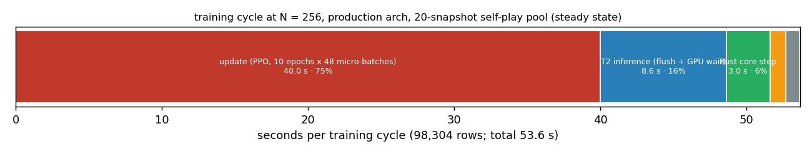
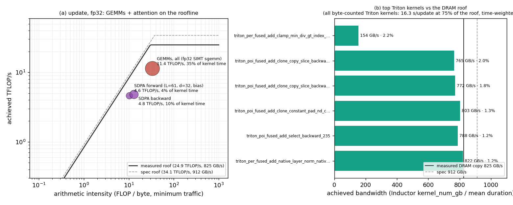

# Pre-X26 BOTTLENECK PROFILE — what limits each phase of a training cycle (2026-10-03/04)

**Question (owner, 2026-10-01):** before the long X26 baseline, what LIMITS each phase of a training cycle —
CPU cores, GPU DRAM bandwidth, compute (tensor or CUDA cores), kernel-launch latency, or host Python?

**Verdict, in one line.** A steady-state cycle at N = 256 is **~54.4 s**:

- the **PPO update** is **74 %** of it. It is **GPU-bound** at 92 % busy: fp32 SIMT GEMMs run at 46 % of the
  fp32 peak, and Inductor's memory-bound Triton kernels run at 75 % of the DRAM roof. The remaining 8 % are
  host-launch bubbles;
- the **rollout** is **25 %**. Of its host step, 69 % is **T2 inference**, bound by small-kernel latency:
  ~21 CUDA graphs of ~590 kernels per host step, 5.7 µs each, at ~57 % GPU utilisation. 24 % is the **Rust
  core**, bound by CPU cores (8 workers ~84 % busy during the step; 12 or 16 threads buy +2–4 %);
- **eval** is **1.8 %**, bound by host Python.

The **next big lever is lower precision** (bf16 with decisions in fp32): it attacks both update limiters.
Before it can pay off, the update's host work has to be cut first (CUDA-graph the R1 micro-step). Otherwise
the host main thread becomes the wall at roughly a 1.4× faster GPU. Tags: **MEASURED** unless marked
**ESTIMATE** / **UNVERIFIED**.

- **Commits profiled.** Run 1 at `5876c2ea`, the commit the brief started on. Run 2 at `336ddd27`, the Beat
  Up exact model. A pre-`f0310ee7` arm at `aecccb23` for the update-time A/B. The fix commit `174f5e62` was
  used for the GPU slow tests.
- **Box.** RTX 3080 Ti (GA102, 80 SM, 12 GiB), driver 595.91, torch 2.8.0+cu126, AMD 8C/16T, fp32 only (TF32
  RETIRED).

## Method

- **Production shape.** `--arch production`, fresh, N = 256, n_steps 384 → 98,304 rows per rollout, batch
  2,048 × accumulation 32, 10 epochs = 480 micro-batches per update. Rust env core (proc front end, 8
  threads), T2 graph backend, 8 lanes, buckets (8, 64, 256).
  - Launched by the trainer directly, under the GPU lease (`gpu_lock.sh` + `mem_cap.sh 48`, timeout
    inside), into a scratch `GEN3AI_MODELS_DIR` on disk under the job directory.
  - Phase markers come from `scripts/phase_probe_run.py`. It runs the trainer's own `main()` unchanged and
    wraps class attributes from outside with an NVTX range and a JSONL timestamp each: `collect`, `update`,
    `eval`, plus the collector's `prepare` / `step_core` / `finish` and the T2 flush. Nothing inside a
    compiled region is wrapped.
- **The steady-state opponent mix.** A fresh run's pool is empty, and it plays bots in-core until it
  promotes. That is not the regime X26 lives in.
  - The run directory was **pre-seeded with a 20-snapshot pool**: the sizing-lineage checkpoints, their
    weights transplanted into a HEAD-built template by `scripts/transplant_pool.py`.
  - Why the transplant: every archived zip has a different FORWARD fingerprint and T2 refuses it. See
    FINDING F-BP-4.
  - Self-play then ran at 90 % from the first rollout: ~85k of 98k opponent decisions per rollout were T2
    policy rows (`rust_env/p2_policy_decisions`).
  - Run 1 shows the trap: at its first eval the fresh trainee's real bot win rate replaced the seeded 0.94,
    and the self-play fraction fell to 0, so every later rollout was bots in-core. That is regime B, kept
    as a contrast.
  - Run 2 therefore used `--eval-freq 50000000`, which means no eval in-run, and stayed in the steady
    regime A for all 18 updates. Eval was read off run 1.
- **Tools.**
  - **Nsight Systems** 2026.5.1 CLI, extracted from NVIDIA's devtools repo under the job directory. Run as
    `nsys launch` with CUDA and NVTX tracing and graph-node tracing, plus `nsys start` / `nsys stop` over
    3-cycle windows.
  - **torch.profiler.** One whole update with `record_shapes` and `with_flops`, no `with_stack`. It gave
    shapes and FLOPs only; its CUDA times were empty while nsys held CUPTI (F-BP-6).
  - **Inductor's own per-kernel byte counts** (`kernel_num_gb`, emitted with
    `TORCHINDUCTOR_BENCHMARK_KERNEL=1`; run 2 only).
  - `nvidia-smi` sampled at 2 Hz.
  - A per-thread `/proc` CPU sampler with the windowed contention meter, `scripts/cpu_sampler.py`.
  - Measured GPU ceilings, `scripts/gpu_ceilings.py`.
- **Not available.** Nsight Compute and nsys GPU-metric sampling: the driver restricts GPU performance
  counters to admin (`RmProfilingAdminOnly: 1`, no sudo). There is no achieved-FLOPs or DRAM counter
  reading. The roofline uses analytical FLOPs and Inductor's byte counts instead (F-BP-5).
- **Contention (rule 8).** Every CPU-phase number comes only from sampler windows whose windowed factor
  read < 1.05; contended windows are EXCLUDED, never tolerated.
  - Run 1: 138 update, 39 play and 18 eval windows dropped. Run 2: 78 update and 49 play windows dropped.
    Other agents' gates ran during both runs.
  - The update-time A/B drops every contended update the same way (`scripts/update_ab.py`).
  - GPU-kernel numbers are reported with the same windows.

## Per-phase table (steady state, run 2 regime A; eval from run 1)

| phase | wall per cycle | share | limiting resource | evidence | headroom |
|---|---|---|---|---|---|
| **update** (R1 micro-steps, staged batches, optimizer) | 40.0 s median plain update (`update_ab.json`); a diagnostics update every 10th ≈ 47 s (+0.7 s mean) | **73.5 %** | **GPU**: DRAM bandwidth (Triton, 47 % of kernel time) + fp32 CUDA-core GEMM (35 %) + attention latency/occupancy (14 %); ~8 % idle = host bubbles | GPU busy (union of kernel intervals) 92.2 %; `nvidia-smi` 94 %, 327 W of 350 W, SM 1,856 MHz (run 1). GEMMs: 150.3 TFLOP per update in 13.2 s = **11.4 TFLOP/s** (46 % of the measured fp32 peak 24.9; AI ≈ 33 sits on the ridge, AI* = 30). Triton: 16.3 s with byte counts at **75 % of the measured DRAM roof** (time-weighted). SDPA (L = 61, d = 32, additive bias): fwd 4.6 / bwd 4.8 TFLOP/s ≈ 45–55 % of its roof. Host main thread **0.92 CPU busy** (+0.12 autograd thread); 1.04 M kernels per update; ~764 D2H scalar reads per update each block ~22.6 ms (the GPU queue depth) | fp32: ≤ ~3 s from the idle bubbles. bf16 tensor cores + bf16 activations: ~2× (**ESTIMATE**) — but see the host wall below |
| **T2 inference** (trainee + 20 pool forwards, CUDA graphs) | 21.5 ms per host step × ~400 = **8.6 s** (flush 6.7 ms host launch + 14.8 ms GPU wait) | **15.8 %** | **kernel latency at tiny batch** (GPU-side: ~590 serial small kernels per graph, 5.7 µs mean) × fan-out (21 graphs / step over 8 lanes), plus the host cost of 21 `cudaGraphLaunch` per step | per step: 21 graph launches, 12.4 k kernels; `nvidia-smi` 57 % during play; prepare-window GPU busy 84 % of kernels that are latency-bound (sgemm_32x32 9.8 µs; tiny M). Regime B (bots in-core) flush 1.2 ms + wait 4.0 ms | the fan-out: fewer graphs per step (grouped or batched opponent forwards), fewer kernels per forward, bf16 — up to ~5 s / cycle (**ESTIMATE**) |
| **Rust core step** | 7.5 ms × ~400 = **3.0 s** | **5.5 %** | **CPU cores** (8 worker threads) | env-core 6.7 of 8 worker CPUs busy during the step (quiet windows); sizing study at N = 1,024: 12 / 16 threads +2.3 % / +4.0 % (SMT) | small; regime B (core plays the bots too) 9.4 ms |
| **host glue** (submit, draws, arena write, post, fill) | 2.1 ms / step + fill 0.24 s = **1.1 s** | **2.0 %** | host Python (main thread) | collector timers: submit 0.6, opp_draw 0.3, draw 0.1, write 0.5, post 0.6 ms; main thread 0.76 CPU during play | not worth it |
| **eval** (blocking in-process cycle, 1 per 2 M steps in production) | 19.5 s per cycle (17.3 / 22.0 / 19.1 s uncaptured) ÷ 20.3 rollouts = **0.96 s** amortised | **1.8 %** | **host Python** (main thread 0.88 CPU) + small-batch graph latency | GPU util 22 %; 3.35 M graph-node kernels per cycle, 2.9 µs mean; Rust 0.77 CPU | not worth it |

Cycle total ≈ 54.4 s: 40.0 + 13.4 play + 0.96 eval. One rollout's wall, 13.1–13.4 s, matches the collector's
timer sum of 31.1 ms × ~400 host steps + 0.24 s fill.

## The top-10 kernels of the update (run 2 window, per update)

| kernel | calls | s / update | share | placement |
|---|---|---|---|---|
| `fmha_cutlassB_f32_aligned_64x64_k32_sm80` (SDPA backward) | 1,920 | 3.87 | 10.2 % | 4.8 TFLOP/s, ~376 GB/s (AI ≈ 13) |
| `ampere_sgemm_128x64_tn` | 13,007 | 3.41 | 9.0 % | fp32 SIMT GEMM |
| `ampere_sgemm_128x128_nt` | 2,880 | 2.46 | 6.5 % | fp32 SIMT GEMM (weight-grad) |
| `ampere_sgemm_128x64_nn` | 12,000 | 2.13 | 5.6 % | fp32 SIMT GEMM |
| `fmha_cutlassF_f32_aligned_64x64_rf_sm80` (SDPA forward) | 1,928 | 1.62 | 4.3 % | 4.6 TFLOP/s, ~450 GB/s (AI ≈ 10) |
| `cutlass::Kernel2<…simt_sgemm_128x64_8x5_nt…>` | 9,600 | 1.05 | 2.8 % | split-K weight-grad GEMM (K = 124,928) |
| `triton_per_fused_…logsumexp…sigmoid_backward…_360` | 480 | 0.83 | 2.2 % | **154 GB/s = 19 % of the roof** (an outlier: reduction-bound, not DRAM) |
| `triton_poi_fused_add_clone_copy_slice_backward_zeros_like_338` | 480 | 0.77 | 2.0 % | 765 GB/s = 93 % |
| `triton_red_fused_…gather…logsumexp…reciprocal…` (damage-op-shaped) | 480 | 0.70 | 1.8 % | no unique byte count (name collides across graphs) |
| `triton_poi_fused_add_clone_copy_slice_backward_zeros_like_320` | 480 | 0.68 | 1.8 % | 772 GB/s = 94 % |

- **By class** (`results/update_kernel_classes.json`): GEMM 13.2 s (34.7 %), Triton pointwise 11.0 s
  (29.0 %), Triton reductions 6.8 s (18.0 %), attention 5.5 s (14.4 %), aten elementwise 0.67 s (1.8 %,
  ~177 k launches of ~3.8 µs), the rest ≤ 1 %. The optimizer is fused: 760 launches, 0.01 s.
- **The GEMMs are the history-event transformer's.** M = 2,048 × 61 = 124,928 tokens; d = 128, FFN 256,
  QKV 384 (`results/update_gemm_shapes_top40.json`). Skinny shapes (N, K ≤ 412) top out at ~17–19 TFLOP/s in
  fp32 even in isolation (`results/gpu_ceilings.json`).

**Ceilings used (`results/gpu_ceilings.json`, idle GPU).** fp32 GEMM 24.9 TFLOP/s (8192³; spec 34.1 at the
1,665 MHz boost, NVIDIA GA102 whitepaper / RTX 3080 Ti spec sheet). DRAM 825 GB/s (D2D copy; spec 912 GB/s,
GDDR6X 19 Gbps × 384-bit). Eager launch floor 2.34 µs per op on the host. Graph-node replay 0.94 µs per node.

## Kernel launches and gaps (update)

- 1.04 M kernels per update, ≈ 2,170 per micro-batch, ≈ 25 k launches per second of wall. On the main
  thread: `cuLaunchKernel` 316 k and `cudaLaunchKernel` 119 k per update. The backward's launches are on the
  autograd thread.
- **Gaps on the busiest stream (run 2):** p50 0.74 µs, p90 3.3 µs, p99 22.6 µs; idle 7.8 % of the stream
  span. Run 1's window, taken during host contention, read 12.6 %.
- **Run 1's idle broken down** (5.3 s per update):
  - gaps < 5 µs: 0.74 s;
  - 5–100 µs, launch-bound stretches of small kernels: 2.6 s;
  - 0.1–10 ms, drain-and-refill after host syncs: 1.2 s;
  - over 10 ms: 0.7 s.
  - Gaps that begin at a D2H completion: 0.32 s.
- **Why the host is the next wall.** In the update the host main thread is ~92 % busy, and ~11 s of that per
  update is spin-blocked in ~764 D2H reads waiting on a ~22 ms-deep queue. Real host work is therefore ≈
  26 s per 40 s update (**ESTIMATE**). A GPU-side speed-up much beyond ~1.4× makes the update host-bound
  unless the per-micro-step launch work shrinks.

## CPU occupancy (quiet windows only)

| phase | python main thread | other python threads | Rust env core (8 workers) | box busy CPUs (of 16) |
|---|---|---|---|---|
| update | 0.92 | 0.12 (autograd) | 0.00 | 2.4–2.7 |
| play, regime A (run 2) | 0.76 | 0.04 | 1.62 averaged over play = 6.7 during the core step | 2.7 |
| play, regime B (run 1) | 0.59 | 0.00 | 2.68 averaged over play | 4.2 |
| eval | 0.88 | 0.00 | 0.77 | 2.9 |

## Deferred GPU checks

- **The compiled cost of `f0310ee7` (non-formula damage) and `336ddd27` (Beat Up)**, from `results/update_ab.json`
  (`scripts/update_ab.py`; plain updates only, warm-up / canary / capture / contended updates excluded):

  | arm | commit | plain updates kept | median update | 95 % CI (median) | Δ vs pre |
  |---|---|---|---|---|---|
  | pre | `aecccb23` (before `f0310ee7`) | 12 | 40.35 s | [40.34, 40.40] | — |
  | run 1 | `5876c2ea` (+ non-formula, + X5 U1 behind a flag) | 13 | 40.11 s | [39.95, 40.43] | −0.24 s [−0.44, +0.09] (−0.6 %) |
  | run 2 | `336ddd27` (+ Beat Up) | 8 | 39.90 s | [39.81, 40.11] | −0.45 s [−0.53, −0.24] (−1.1 %) |

  **Read: NO compiled cost DETECTED for either change.** The post-change arms are, if anything, *faster*.
  - The non-formula change (`f0310ee7`) measured +1.1 % on CPU eager. Here its CI straddles 0.
  - Beat Up vs run 1: −0.21 s [−0.53, +0.06]. Its CI also straddles 0.
  - Nothing in these commits can make the update faster, so the run 2 vs pre interval, which excludes 0 on
    the fast side, is process-to-process variation: per-launch autotune / compile choices and thermal
    state. Cross-launch A/B on this box cannot resolve effects below ~1 %.
  - Bound: any compiled cost of the two changes together is < ~1 % of the update (UNVERIFIED below that).
  - A same-process A/B is impossible (neither change has a flag); a sub-1 % read needs the pinned-buffer
    benchmark (`main.compile_inventory --stage time`) at both commits.

- **The compile canary** on a production launch at `336ddd27`: update 10 `compile/canary_ok 1`,
  `canary_unconfirmed_disagreements 0`. T2 came up (parity-gated) and served 18 updates. R1 compiled every
  update; there were no recompiles after the lock.
- **The GPU slow tests** (`GEN3AI_TEST_ALLOW_GPU=1`, serial, under the lease): 18 GPU-gated tests + the 4
  `extractor_compiles` cells, 22 in all.
  - At `336ddd27`, `service_cuda_test::test_aot_backend_one_package_per_bucket_serves_every_slot` FAILED
    deterministically. The cause was a device-side assert "index out of bounds: 0 <= tmp76 < 3" in an
    Inductor kernel, on Beat Up's summed column index. It passes at `5876c2ea`.
  - That failure poisoned the CUDA context, and 16 later tests failed with it. Run alone, the other 21
    passed.
  - Fixed in `174f5e62` (`gen3_beatup_pidx_bounded_v1`). At the fix all 22 PASS; rows committed in
    `970e1078`. No real move carries both bits, so the fix is value-identical.

## Ranked next speedups

1. **R1 micro-step under CUDA graphs** (or otherwise fewer host launches per micro-step). Expect ≈ 2–3 s per
   update from the launch-bound gaps (5–7 %).
   - More important: this is the PREREQUISITE for lever 2. Today the host has only ~30 % slack in the update.
   - Includes: removing the per-micro-step D2H scalar reads and stream syncs (~764 reads + ~950 syncs per
     update, each a full drain), and fusing the ~350 per-parameter grad-accumulate adds per micro-batch
     (~177 k tiny kernels per update).
2. **bf16 compute with fp32 decisions / accumulation.** Update GEMMs 13.2 s → ~3–4 s on tensor cores;
   memory-bound Triton 17.8 s → ~9 s at half the bytes; SDPA 5.5 s → ~2–3 s (a flash kernel at d = 32 in
   bf16).
   - ESTIMATE: update 40 → ~20 s, i.e. cycle 54 → ~34 s (−37 %), only once lever 1 lands.
   - Also halves T2's per-kernel work, but T2 is latency-bound, so less is gained there.
   - The biggest lever. It needs the parity / fp32-decision design the owner sketched (TF32 retired).
3. **T2 fan-out.** ~21 graph launches per host step at ≤ 64 rows each, 590 serial kernels per graph. Group
   opponent slots into fewer, larger forwards (vmap is blocked by in-place writes, T2 PROGRESS).
   - Or capture a multi-slot graph, or cut kernels per forward (fusion; the AOT backend now works again).
   - Up to ~5 s per cycle (≈ 10 %, ESTIMATE). The ceiling at N = 48 was 1.59–1.74×; it was not adopted
     because it changes the opponent distribution (M5 Decision record).
4. **The single reduction-bound Triton kernel** (`…logsumexp…sigmoid_backward…_360`, 19 % of roof,
   0.83 s per update) and the cuBLAS split-K weight-grad GEMMs. Small (~1–2 %), but local.

**What NOT to bother with:**

- **The Rust core:** 5.5 %, CPU-bound at 8 threads; more threads +2–4 %, and overlapping it with T2 measured
  0.85× at N = 256 (M5 sizing).
- **Host glue:** 2 %.
- **Eval:** 1.8 %.
- **The optimizer:** fused, ~0 %.
- **The staged H2D copies:** 11.9 GB per update at 25 GB/s = 0.47 s of DMA, all overlapped, pinned and
  non-blocking.
- **More CPU threads for the update:** the update is GPU-bound.

## Findings

- **F-BP-1 (FIXED, `174f5e62`).** Beat Up's damage-op column index `phys + 2*bu` tripped the T2 AOT
  package's Inductor index assert on CUDA. Above.
- **F-BP-2 (trap for any steady-state profile or short arm).** A fresh run with a pre-seeded pool loses
  self-play at its FIRST eval: the trainee's real win rate replaces the seeded one. Run 1 was all-bots from
  rollout 7.
- **F-BP-3.** `nsys` graph-node tracing roughly doubles host graph-launch cost: eval 37.8 s under capture
  vs 17–22 s, T2 flush 22.8 vs 6.7 ms per step. Read graph-heavy phases' wall from uncaptured cycles only;
  kernel tables are fine.
- **F-BP-4 (MAJOR for pools).** The FORWARD fingerprint changed between `aecccb23` and `5876c2ea`
  (`f0310ee7` or the X5 U1 commit `b870350d`, not isolated). So NO archived snapshot from before 5876c2ea
  can be served as a pool opponent beside a HEAD trainee: T2 refuses it with `SlotArchMismatch`.
  - Any fork whose pool is seeded from an old lineage FAILS at T2 startup. `scripts/transplant_pool.py`
    (strict state-dict load into a HEAD template) is a workaround, not a fix. It is the orchestrator's call.
- **F-BP-5.** Nsight Compute and GPU-metric sampling are unavailable (`RmProfilingAdminOnly: 1`). Achieved
  FLOPs and bytes here are analytical or Inductor-declared, not counter readings.
- **F-BP-6.** torch.profiler records NO CUDA activity while `nsys launch` holds CUPTI. Run them in
  separate processes.
- **F-BP-7.** `ptrace_scope` reads **1** on this boot (memory says the owner keeps 0), so py-spy could not
  attach. Host attribution here is from CUDA API tracing + `/proc` per-thread CPU. Not changed (no sudo).
- **F-BP-8 (observed, cause UNVERIFIED).** A direct trainer fork (`--model sizing_B/final_model.zip
  --run-name …`, no launcher) started with 32 envs and a bots-only mix: it did not inherit N = 256 or
  `--self-play` from the parent, and checkargs prints the same values as "untyped default". This is at
  odds with root CLAUDE.md's "every flag you do not name is INHERITED". It may be by design for the
  recipe knobs; not investigated (out of scope).

## Files

- `scripts/`
  - `phase_probe_run.py`: the trainer with phase markers, plus the env-gated `PROF_TORCH_UPDATE`.
  - `cpu_sampler.py`, `gpu_ceilings.py`, `transplant_pool.py`.
  - `nsys_phase_read.py`, `analyze_phases.py`, `roofline.py`, `update_ab.py`, `make_figures.py`.
- `results/`
  - `phase_read.json` (run 1) and `phase_read_r2.json` (run 2): cycles, CPU by phase, smi, TB timers.
  - `nsys_read_win1.json` and `nsys_read_r2win.json`: per-phase GPU busy, API, memcpy, classes, top
    kernels.
  - `top_kernels_update.json`, `update_kernel_classes.json`, `update_gemm_shapes_top40.json`,
    `gpu_ceilings.json`, `update_ab.json`.
- Raw traces stay LOCAL (too large to commit), under `/home/goodlad/.claude/jobs/9c36ca35/prof/`:
  `win1.nsys-rep` (357 MB, run 1, updates 9–12, incl. one eval), `r2win.nsys-rep` (743 MB, run 2, regime A,
  updates 7–10), their `.sqlite` exports, `r2_torch_*` (the profiled update's op tables), phase and CPU JSONL.
  The job directory is session-scoped: copy anything you want kept.
